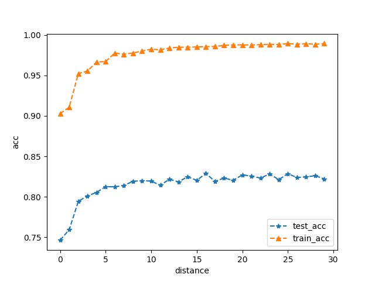

# Tamilnadu Agricultural Analysis
## Abstract
----------------
The goal for this project was to analyze the Tamilnadu agriculture data to figure out the factors that causes a high production rate. However, during our analysis of our features and target, we encountered a problem that no longer allowed us to continue further with our machine learning. 

## Main
-----------
### Data Structure

In order to proceed with our data analysis, we first need to pre-process our data. The first steps we took in our pre-processing was to check the amount of null values in our data. We found out that the shape of our dataset was 13547 by 7 and that we have 281 null values for production. 

### Preprocessing 

To fix the issue of having the null values, we took the median of the production values and filled in the null values. However, for our "State_Name" column, it was decided that this information would not be of great use to us and decided to remove it. 

As shown, the median of the production values, 841, was used to replace all of the null values in the dataset. 

### Analysis

<h4> - (M = million(1,000,000)) (x = year, y = average area)</h4>
As shown in the image, Tamilnadu is a state in the most southern part of India. This graph shows the relationship between the average area used for the production of crops and the year in which it was recorded. The graph presents a point of max of around 12M in the year of 1998 and a low of around 3M in 2012. 

The districts of Tamilnadu that were used for the purpose of agriculture can be shown with the graph above. This graph depicts the accumulation of land that were used from the year of 1997 to 2013 with a high of 459,259M of land was used from in the district of Villupuram and a low of 5496M of land was used in the district of The Nilgiris. 

<h4> - (Blue = Kharif (monsoon season)) (Red = Whole Year) (Green = Rabi (winter season))</h4>
The production of crops is shown above in relation to the area used and the crop season. It is shown that the crops that are available for harvest all year long can result in the largest amount of crops compared to the Rabi crops that only have a few months for harvest. The Kharif crops are shown to fit in-between the two, in terms of production, for it has more time for harvest than the Rabi crops but less than the year-long crops. However, despite which seasonal crops are being harvested, as the given amount of land availalbe for farming does not affect the result of the production.

### Mechine learning
After thorough analyzation of the Tamilnadu Crop dataset, the use of machine learning classification was decided on. 

At first, the use of machine learning regression was attempted. However, shortly after attempting to execute regression on the dataset, a problem of failing to train the data architecture was encountered. 

When investigating the reason for the failure of using regression, a thorough check of the dataset was done. 
The dataset's architecture could not support regression for the data did not have the requirement of having a linear architecture. 

Once it was confirmed that regression would not support our dataset, the change of direction was done to attempt machine learning classification. 

### Classification
To perform classification, the X and Y values had to be decided on.
+ x (Crop year, area, production)
+ y (Season data)

### Training Report

Two models of classification were used, knn and random forest. First, the model knn was executed without any customization which resulted in accuracy of around 60-69%. 

For the use of the basic form of the model knn resulted in a low accuracy, the normalization method standardscale was applied, to retry the knn model. 

<h4>It resulted with an accuracy of 70-78%. Although the accuracy have gone up by a mere 10%, 
  it is evident that the model knn is not well suited for the dataset at hand. </h4>
  
+ RandomForest
  + With the given range, RandomForest is a decision tree that chooses the best circumstances for an optimal result, also represented as an ensemble training method. 

<h4>One of the ensemble training methods, RandomForest resulted in a accuracy of 80-88%. Thus, a clear jump in accuracy, with a minium of 10% to a max of 25%, can be shown, resulting in using RandomForest as a superior model for our dataset.  </h4>
